# JomBudget

JomBudget is a role-based Flutter mobile app prototype for **student budget travel planning in Malaysia**.
It implements traveler, vendor, and admin workflows with a deterministic budget optimizer, mock checkout, booking lifecycle management, and moderation/reporting tools.

> See [USER_MANUAL.md](USER_MANUAL.md) for a full walkthrough of all features across all three roles.

## Implemented Scope

- Single app with role-based login and routing.
- Traveler features:
  - Browse/search/filter listings.
  - Budget-first itinerary generation.
  - Mock booking + payment + in-app receipt dialog.
  - Availability conflict protection for overlapping booking dates.
  - Q&A inquiries to vendors (public or private question mode).
  - Booking history, cancellation requests, review submission.
- Vendor features:
  - Listing CRUD, image upload, and activation toggles.
  - Blackout window availability management per listing.
  - Booking approval/rejection.
  - Earnings/performance summary.
  - Review replies and inquiry responses.
- Admin features:
  - User and listing moderation.
  - Admin delete flow for listings (with active-booking guard).
  - Destination CRUD + activation management.
  - Booking override for cancellations/refund simulation.
  - Review flagging and inquiry thread visibility.
  - Admin inquiry response support.
  - Report snapshot (bookings, revenue proxy, popular listings, cancellation trends).

## Demo Credentials

- Traveler: `traveler@student.my` / `pass123`
- Traveler 2: `irfan@student.my` / `pass123`
- Traveler 3: `meiling@student.my` / `pass123`
- Vendor: `vendor@langkawi.my` / `pass123`
- Vendor 2: `vendor@klfood.my` / `pass123`
- Vendor 3: `vendor@borneo.my` / `pass123`
- Admin: `admin@jombudget.my` / `pass123`

## App Screenshots

Screenshots are stored in `assets/screenshots/`.

### Authentication and Traveler Flow

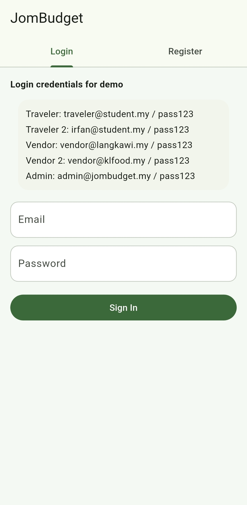
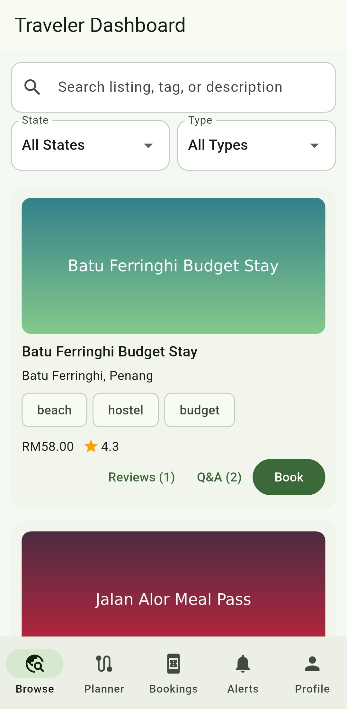
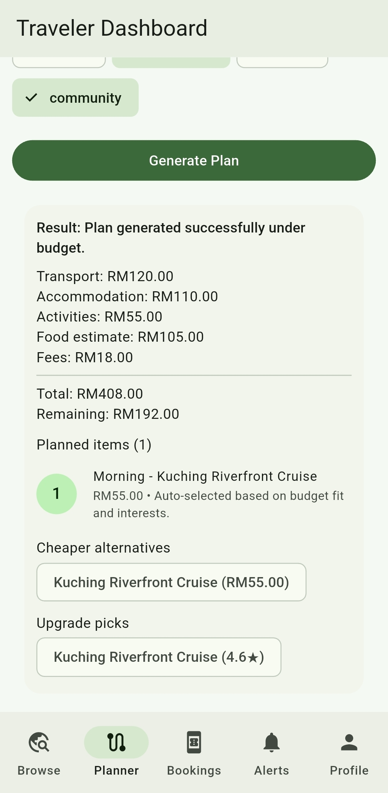
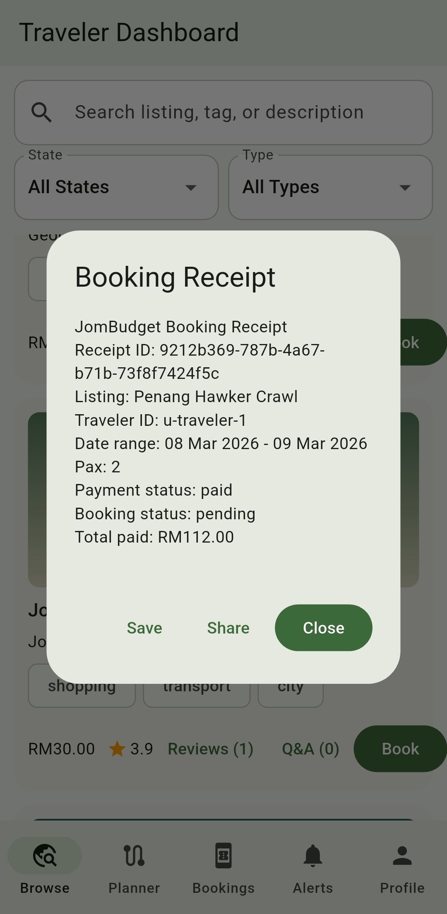
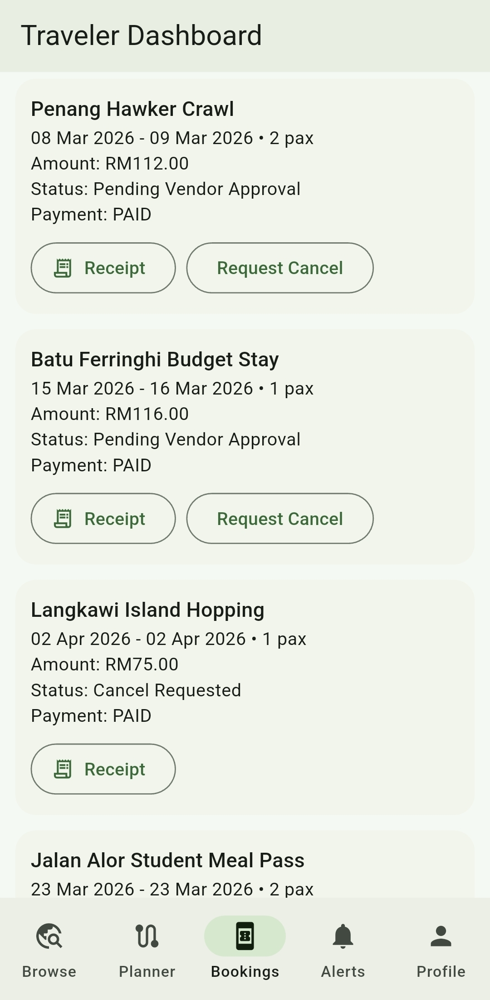

### Vendor Flow

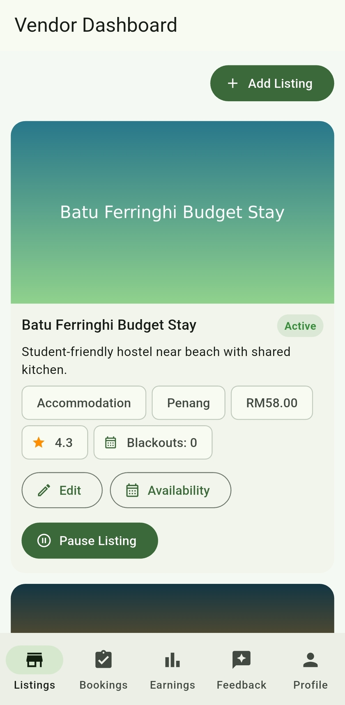
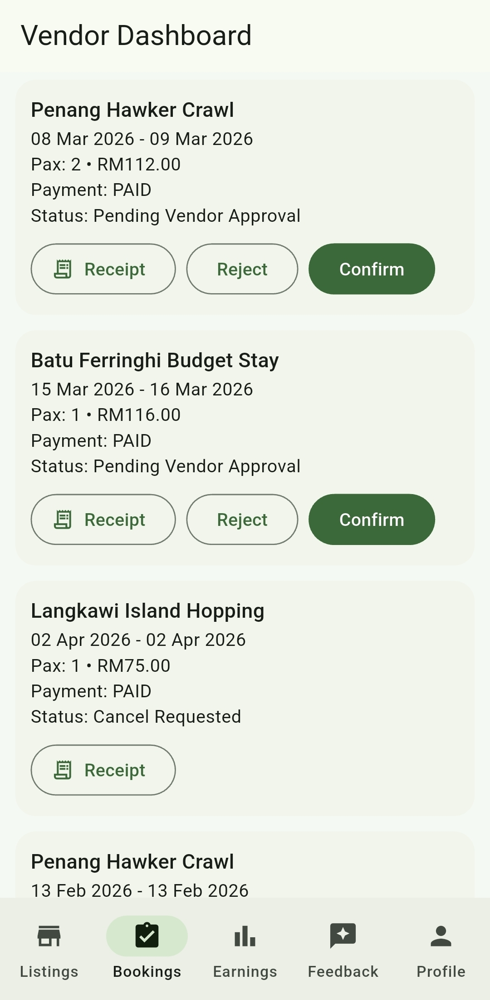
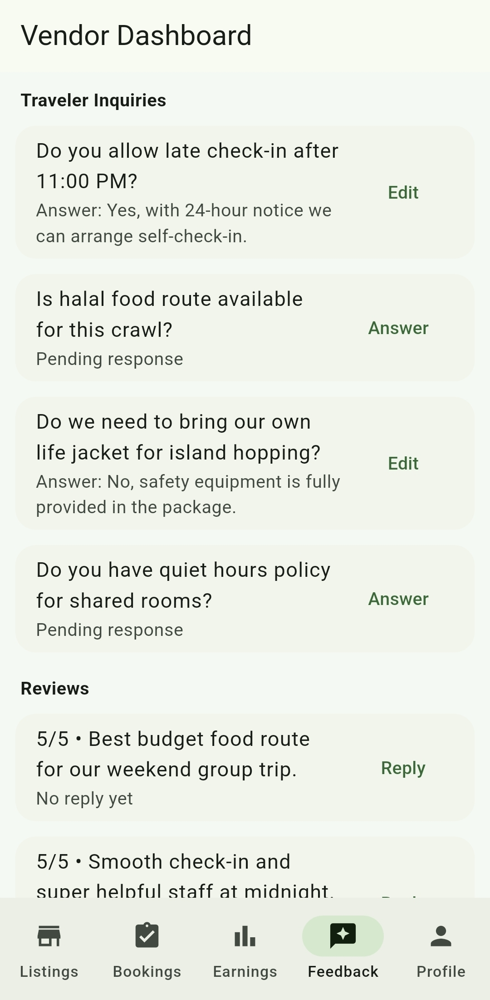

### Admin Flow

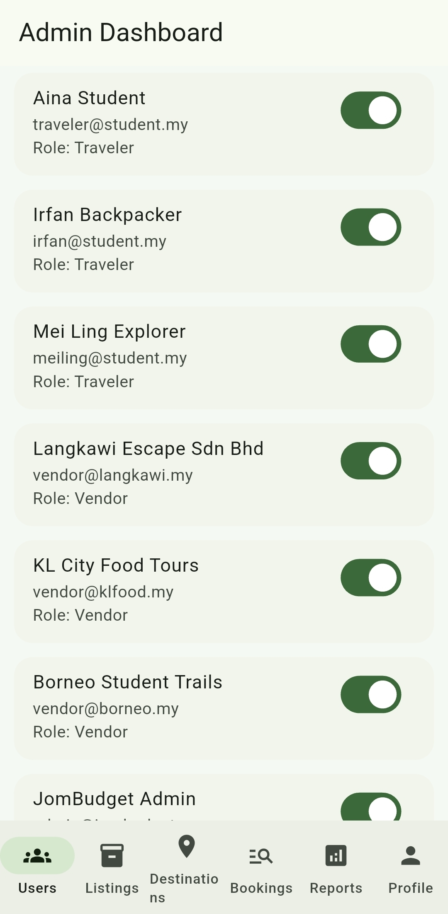
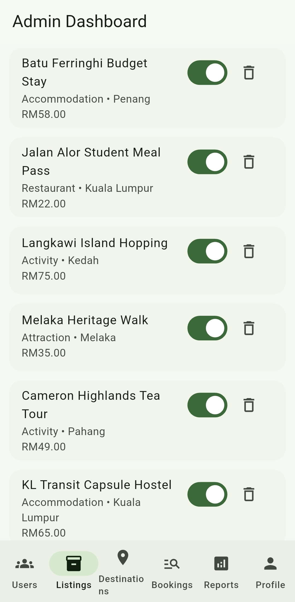
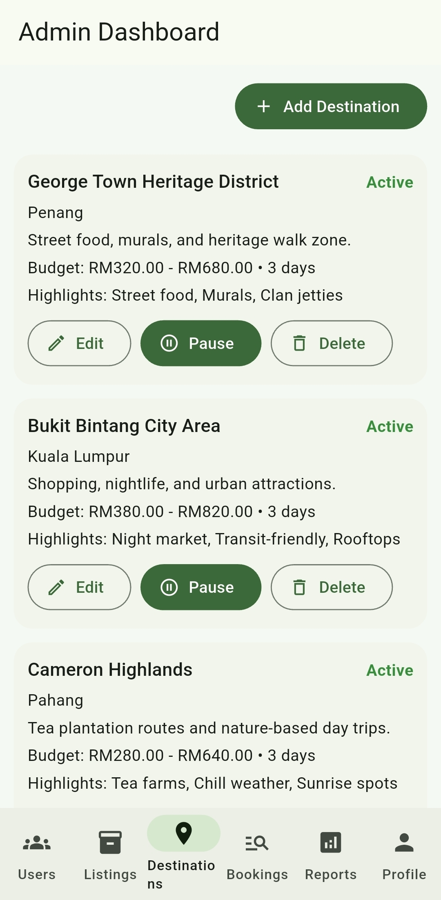
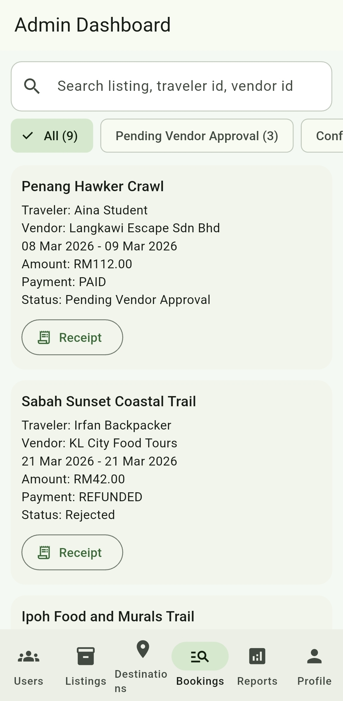
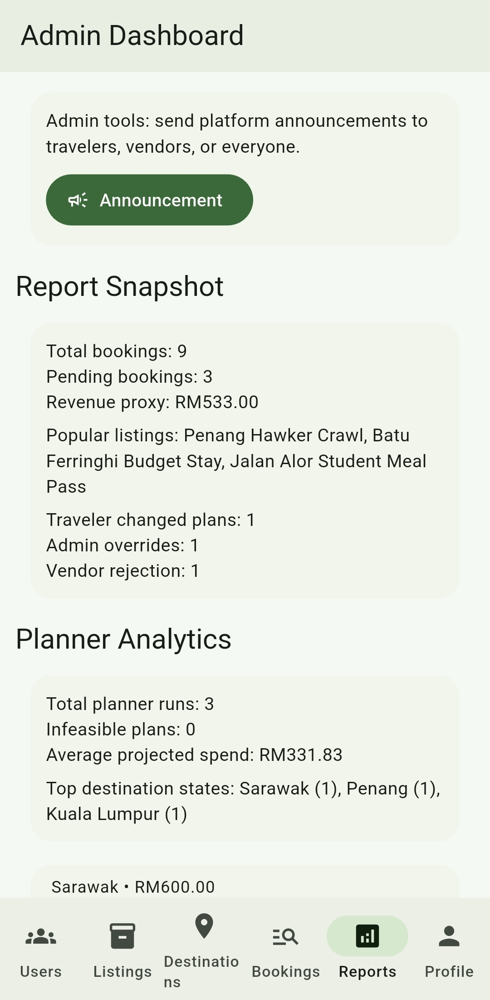

## Tech Stack

- Flutter (Material 3)
- State management: `provider`
- In-memory repositories with service layer abstraction + local snapshot persistence (`shared_preferences`)
- Firebase (Authentication, Firestore, Storage):
  - `firebase/firestore.rules`
  - `firebase/firestore.indexes.json`
  - `functions/index.js` (Cloud Functions template)
  - `firebase/seed_firestore.js` (seed script for demo data)

## Project Structure

- `lib/domain/models.dart`: core entities and enums.
- `lib/data/`: seed data and in-memory repositories.
- `lib/services/`: auth, itinerary, booking, notification, admin services.
- `lib/state/app_state.dart`: app orchestration and role actions.
- `lib/ui/`: auth + traveler/vendor/admin screens.
- `firebase/`: Firestore rules, indexes, and seed script.
- `functions/`: Node Cloud Functions templates.

## Run

```bash
flutter pub get
flutter run
```

Build APK:

```bash
flutter build apk --release
```

## Notes

- App uses Firebase by default. Requires `lib/firebase_options.dart` and `android/app/google-services.json` (not tracked — obtain from Firebase Console).
- Falls back to in-memory seeded data if Firebase is unavailable.
- Local snapshot persistence means data changes (bookings, reviews, etc.) survive app restarts even without Firebase.
- Demo images are bundled under `assets/demo_images/` so listing previews work offline.
- To seed Firestore with demo data and images: `cd firebase && node seed_firestore.js` (requires `firebase/serviceAccountKey.json`).

## Automated Testing

Unit and widget tests:

```bash
flutter test test/services/booking_service_test.dart
flutter test test/services/itinerary_service_test.dart
flutter test test/widgets/role_routing_test.dart
flutter test test/widgets/booking_flow_test.dart
```

Run all unit/widget tests at once:

```bash
flutter test
```

Integration test:

```bash
flutter test integration_test/login_flow_test.dart -d linux
```
